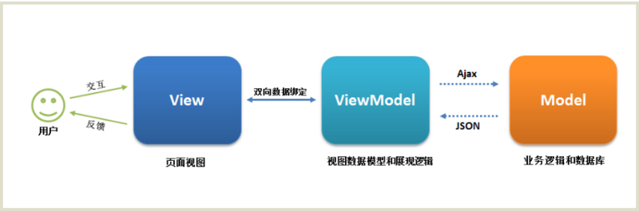

#Vue学习-01
##1.基本使用
###1.1 Vue.js-HelloWorld
```
<!DOCTYPE html>
<html lang="en">
<head>
    <meta charset="UTF-8">
    <title>01</title>
</head>
<body>
    <div id="app">
        <div>{{ msg }}</div>
    </div>
    <script src="js/vue.min.js"></script>
    <script>
        var vm = new Vue({
            el:'#app',
            data: {
                msg: 'Hello Vue!'
            }
        });
    </script>
</body>
</html>
```


##2.Vue.js之HelloWorld细节分析
1.实例参数分析
  -el：元素的挂载位置（值可以是css选择器或者dom元素）
  -data：模型数据（值是一个对象）

2.插值表达式语法
  -将数据填充到HTML标签中
  -插值表达式支持基本的计算操作

3.Vue代码运行原理分析
  -概述编译过程的概念（Vue语法->原生语法）

##3.Vue模板语法
###3.1 模板语法概述
1.如何理解前端渲染？
把数据填充到HTML标签中
**模板+数据 =》 前端渲染 =》静态HTML内容**

2.前端渲染方式
* 原生js拼接字符串
* 使用前端模板引擎
* 使用Vue特有的模板语法

3.原生js拼接字符串
基本上就是将数据以字符串的方式拼接HTML标签中。
缺点：不同开发人员的代码风格差别很大，随着业务的复杂，后期的维护变得逐渐困难了起来

4.使用前端模板引擎
优点：大家遵循同样的规则写代码，代码可读性明显提高，方便后期维护
缺点：没有专门提供事件机制

5.模板语法概览
* 差值表达式
* 指令
* 事件绑定
* 属性绑定
* 样式绑定
* 分支循环结构

###3.2 指令？
1.什么是指令
* 什么是自定义属性
* 指令的本质就是自定义属性
* 指令的格式：以v-开始（比如v-cloak）

2.v-cloak指令用法
* 插值表达式存在的问题：“闪动”
* 如何解决该问题：使用v-cloak指令
* 解决该问题的原理：先隐藏，替换好值之后再显示最终的值
```
<!DOCTYPE html>
<html lang="en">
<head>
    <meta charset="UTF-8">
    <title>Document</title>
    <style>
        [v-cloak] {
            display: none;
        }
    </style>
</head>
<body>
    <div id="app" v-cloak>{{}}</div>

    <script src="js/vue.min.js"></script>
    <script>
        /*
            1.提供样式
            [v-cloak] {
                display:none
            }
            2.在插值表达式所在的标签中添加v-cloak指令
        */
        var vm = new Vue({
            el: '#app',
            data: {
                msg: 
            }
        })
    </script>
</body>
</html>
```

3.数据绑定指令
* v-text 填充纯文本
 -相比插值表达式更加简洁
```
<div id="app" v-text='msg'></div>
//和上面一样
<div id="app">{{msg}}</div>
```

* v-html 填充html片段
 -存在安全问题
 -本网站内部数据可以使用，来自第三方的数据不可用

* v-pre 填充原始信息
 -显示原始信息，跳过编译过程

4.数据响应式
* 如何理解响应式
 -html5中的响应式（屏幕尺寸的变化导致样式的变化）
 -数据的响应式（数据的变化会导致页面内容的变化）

* 什么是数据绑定
 -数据绑定：将数据填充都标签中

* v-once 只编译一次
 -显示内容之后不再具有响应式功能

###3.3 双向数据绑定
1.什么是数据双向绑定


2.双向数据绑定分析
 * v-model 指令用法
```
 <input type="text" v-model="uname">
```

```
<div id="app">
        <div>{{ msg }}</div>
        <input type="text" v-model='msg'>
</div>

<script src="js/vue.min.js"></script>
<script>
    var vm = new Vue({
        el: '#app',
        data: {
            msg: 'hello world'
        }
    })
</script>
```

3.MVVM设计思想
* M（Model）
* V（View）
* VM（View-Model）


###3.4 事件绑定
1.Vue如何处理事件
* v-on指令用法
```
<input type="button" v-on:click="num++"/>
```

* v-on简写形式
```
<input type="button" @click="num++"/>
```

2.事件函数的调用方式
* 直接绑定函数名称
```
<button v-on:click='say'></button>
```

* 调用函数
```
<button v-on:click='say()'></button>
```

3.事件函数参数传递
* 普通参数和事件对象
  -如果事件直接绑定函数名称，那么默认会传递事件对象作为事件函数的第一个参数
  -如果事件绑定函数掉哟个，那么事件对象必须作为最后一个参数显示传递，并且事件对象的名称
  必须是固定的$event
```
<button v-on:click='say("hi",$event)'></button>
```

4.事件修饰符
* .stop阻止冒泡
```
<a v-on:click.stop='handle'></a>
```

* .prevent阻止默认行为
```
<a v-on:click.prevent='handle'></a>
```

5.按键修饰符
* .enter回车键
```
<input type="text" v-on:keyup.enter='submit'/>
```

* .delete删除键
```
<input type="text" v-on:keyup.delete='submit'/>
```

6.自定义按键修饰符
* 全局config.keyCodes对象
```
Vue.config.keyCodes.f1=112
```

###3.5 简单案列：简单计算器

```
    <div id="app">
        <h1>简易计算器</h1>
        <div>
            <span>数值A：</span>
            <span>
                <input type="text" v-model='a'>
            </span>
        </div>
        <div>
            <span>数值B：</span>
            <span>
                <input type="text" v-model='b' @keyup.enter='handle'>
            </span>
        </div>
        <div>
            <button @click='handle'>相加计算</button>
        </div>
        <div>
            <span>计算结果：</span>
            <span v-text='result'></span>
        </div>
    </div>
    <script src="js/vue.min.js"></script>
    <script>
        let vm = new Vue({
            el: "#app",
            data: {
                a: '',
                b: '',
                result: ''
            },
            methods: {
                handle: function() {
                    //实现计算逻辑
                    this.result = parseInt(this.a) + parseInt(this.b);
                }
            }
        })
    </script>
```

###3.6 属性绑定
1.Vue如何动态处理属性？
* v-bind指令用法
```
<a v-bind:href='url'/>
```

* 简写
```
<a :href='url'/>
```

2.v-model的底层实现原理分析
```
<input v-bind:value="msg" v-on:input="msg=$event.target.value"/>
```

###3.7 样式绑定
1.class样式处理
* 对象语法
```
<div v-bind:class="{active:isActive}"></div>
```
```
<!DOCTYPE html>
<html lang="en">
<head>
    <meta charset="UTF-8">
    <title>Document</title>
    <style>
        .active {
            width: 100px;
            height: 100px;
            border: 1px solid red;
        }
    </style>
</head>
<body>
    <div id="app">
        <div :class="{active:isActive}"></div>
        <button @click='handle'>切换</button>
    </div>
    <script src="js/vue.min.js"></script>
    <script>
        let vm = new Vue({
            el: "#app",
            data: {
                isActive: true
            },
            methods: {
                handle: function() {
                    this.isActive = !this.isActive
                }
            }
        })
    </script>
</body>
</html>
```

* 数组语法
```
<div v-bind:class="[activeClass,errorClass]"></div>
```
```
<!DOCTYPE html>
<html lang="en">
<head>
    <meta charset="UTF-8">
    <title>Document</title>
    <style>
        .active {
            width: 100px;
            height: 100px;
            border: 1px solid red;
        }
    </style>
</head>
<body>
    <div id="app">
        <div :class="[activeClass]"></div>
    </div>
    <script src="js/vue.min.js"></script>
    <script>
        let vm = new Vue({
            el: "#app",
            data: {
                activeClass: 'active'
            },
        })
    </script>
</body>
</html>
```

2.样式绑定相关语法细节
* 对象绑定和数组绑定可以组合使用
* class绑定的值可以简化操作
* 默认的class处理（默认的class会保留，不会被覆盖）

3.style样式处理（和class样式处理差不多）
* 对象语法
```
<div v-bind:class="{color:activeColor,fontSize:fontSize}"></div>
```

* 数组语法
```
<div v-bind:class="[baseStyle,overridingStyles]"></div>
```

###3.8 分支循环结构
1.分支结构
* v-if
* v-else
* v-else-if
* v-show
```
<!DOCTYPE html>
<html lang="en">
<head>
    <meta charset="UTF-8">
    <title>Document</title>
</head>
<body>
    <div id="app">
        <div v-if="score<=100&&score>=90">优秀</div>
        <div v-else-if="score<90&&score>=80">良好</div>
        <div v-else>一般</div>
    </div>
    <script src="js/vue.min.js"></script>
    <script>
        let vm = new Vue({
            el: "#app",
            data: {
                score: 90
            }
        })
    </script>
</body>
</html>
```

2.v-if和v-show的区别
* v-if控制元素是否渲染到页面
* v-show控制元素是否显示（已经渲染到了页面）

3.循环结构
* v-for遍历数组
```
<!DOCTYPE html>
<html lang="en">
<head>
    <meta charset="UTF-8">
    <title>Document</title>
</head>
<body>
    <div id="app">
        <div>水果列表：</div>
        <ul>
            <li v-for='item in fruits'>{{ item }}</li>
            <li v-for='(item,index) in fruits'>{{ item + '--' + index }}</li>
            <li v-for='item in myFruits'>
                <span>{{ item.ename + item.cname}}</span>
            </li>
        </ul>
    </div>
    <script src="js/vue.min.js"></script>
    <script>
        let vm = new Vue({
            el: "#app",
            data: {
                fruits: ['apple','orange','banana'],
                myFruits: [{
                    ename: 'apple',
                    cname: '苹果'
                },{
                    ename: 'orange',
                    cname: '橘子'
                },
                {
                    ename: 'banana',
                    cname: '香蕉'
                }]
            }
        })
    </script>
</body>
</html>
```


* key的作用：帮助Vue区分不同的元素，从而提高性能
```
<li :key='item.id' v-for='item in list'>{{item}}</li>
```

* v-for遍历对象
```
<div v-for='(value,key,index) in object'>{{ value }}</div>
```

##4.Tab选项卡案例

1.实现静态UI效果
* 用传统的方式实现标签结构和样式

2.基于数据重构UI效果
* 将静态的结构和样式重构为基于Vue模板语法的形式
* 处理事件绑定和js控制逻辑

3.声明式编程
* 模板的结构和最终显示的效果基本一致

```
<!DOCTYPE html>
<html lang="en">
<head>
    <meta charset="UTF-8">
    <title>Document</title>
    <style>
        [v-cloak] {
            display: none;
        }

        * {
            padding: 0;
            margin: 0
        }
        #app {
            width: 500px;
            margin: 10px auto
        }
        .tab ul {
            overflow: hidden;
        }
        .tab ul li {
            list-style: none;
            float: left;
            width: 100px;
            height: 45px;
            line-height: 45px;
            text-align: center;
            cursor: pointer;
            border: 1px solid blue;
            margin-right: -1px
        }
        .active {
            background-color: orange;
        }
        .tab div {
            width: 500px;
            height: 300px;
            display: none;
        }
        .tab .current {
            display: block
        }
    </style>
</head>
<body>
    <div id="app" v-cloak>
        <div class="tab">
            <ul>
                <li @click='change(index)' :class='currentIndex==index?"active":""' :key='item.id' v-for='(item,index) in list'>{{item.title}}</li>
            </ul>
            <div :class='currentIndex==index?"current":""' v-for='(item,index) in list'>
                
            </div>
        </div>
    </div>

    <script src="js/vue.min.js"></script>
    <script>
        let vm = new Vue({
            el: "#app",
            data: {
                currentIndex: 0,//当前选项卡的索引
                list: [{
                    id: 1,
                    title: 'apple',
                    path: 'img/apple.png'
                },{
                    id: 2,
                    title: 'orange',
                    path: 'img/orange.png'
                },{
                    id: 3,
                    title: 'lemon',
                    path: 'img/lemon.png'
                }]
            },
            methods: {
                //实现选项卡实现切换操作
                change: function(index) {
                    this.currentIndex = index
                }
            }
        })
    </script>
</body>
</html>
```
