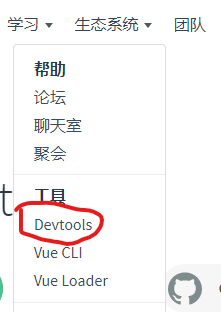

#Vue学习-03
##1.Vue组件化开发思想
###1.1 组件化开发规范：Web Components
* 我们希望尽可能多的重用代码
* 自定义组件的方式不太容易（html、css、js）
* 多次使用组件可能导致冲突

**Web Components通过创建封装好功能的定制元素解决上诉问题**

*Vue部分实现路上述规范*

##2.组件注册
###2.1 全局组件注册语法
```
Vue.component(组件名称,{
    data: 组件数据,
    template: 组件模板内容
})
```

###2.2 组件的使用语法（组件是可以重用的，即每个组件的数据都是独立的，相互不影响的）
```
<组件名称></组件名称>
<组件名称></组件名称>
<组件名称></组件名称>
```

*例如下面定义了一个基本的按钮组件*
```
<!DOCTYPE html>
<html lang="en">
<head>
    <meta charset="UTF-8">
    <title>Document</title>
</head>
<body>
    <div id="app">
        <button-counter></button-counter>
    </div>

    <script src="js/vue.min.js"></script>
    <script>

        Vue.component('button-counter',{
            data: function() {
                return {
                    counter: 0
                }
            },
            template:'<button @click="counter++">点击了{{this.counter}}次</button>'
        })
        let vm = new Vue({
            el: "#app",
            data: {

            }
        })
    </script>
</body>
</html>
```

###2.3 组件注册注意事项
1.data必须是一个函数

2.组件模板内容必须是单个根元素

3.组件模板内容可以是模板字符串

4.组件的命名方式
* 短横线方式
```
Vue.component('my-component',{...})
```

* 驼峰方式
```
Vue.component('myComponent',{...})
```


**如果使用驼峰式命名组件，那么在使用组件的时候，只能在字符串模板中用驼峰的方式使用组件，但是在普通的标签中，必须使用短横线的方式使用组件**


###2.4 局部组件注册
```
var ComponentA={...};
var ComponentB={...};

var vm = new Vue({
    el: "#app",
    components: {
        'component-a':ComponentA,
        'component-b':ComponentB
    }
})
```

###3.Vue调试工具用法
1.安装
点击<https://cn.vuejs.org/>

（1）克隆仓库
（2）安装依赖包
（3）构建
（4）打开chrome扩展页面
（5）选中开发者模式
（6）加载以解压的扩展程序

**点击查看详细教程<https://www.cnblogs.com/xqmyhome/p/10972772.html>**

2.安装步骤出现的问题：**vue-tools遇到的不能读脚本build/hook**
解决办法：
manifest.js文件里的
“persistent”: false
改为true
然后把build都改为src
“scripts”: [
“build/background.js”
],
“js”: [
“build/hook.js”
],
“js”: [
“build/detector.js”
],
如下
“scripts”: [
“src/background.js”
],
“js”: [
“src/hook.js”
],
“js”: [
“src/detector.js”
]

3.使用开发版本的vue.js才可以启动vue-devtools

##4.组件间数据交互
###4.1 父组件向子组件传值
1.组件内部通过props接收传递过来的值
```
Vue.component('menu-item', {
    props:['title'],
    template:`<div>{{title}}</div>}`
})
```

2.父组件通过属性将值传递给子组件
```
<menu-item title='来自父组件的数据'></menu-item>
<menu-item :title='title'></menu-item>
```

3.props属性名规则
* 在props中使用驼峰形式，模板中需要使用短横线的形式
* 字符串形式的模板中没有这个限制

4.props值类型
* 字符串形式String
* 数值类型 Number
* 布尔类型 Bool
* 数组 Array
* 对象 Object

###4.2 子组件向父组件传值
1.子组件通过自定义事件向父组件传递信息
```
<button v-on:click='$emit("enlarge-text")'>扩大字体</button>
```

2.父组件监听子组件事件
```
<menu-item v-on:enlarge-text='fontSize +=0.1'></menu-item>
```

例如扩大字体：

```
<!DOCTYPE html>
<html lang="en">
<head>
    <meta charset="UTF-8">
    <title> </title>
</head>
<body>
    <div id="app">
        <div :style='{fontSize:fontSize + "px"}'>{{pmsg}}</div>
        <menu-item :parr='parr' @enlarge-text='handle'></menu-item>
    </div>

    <script src="js/vue.js"></script>
    <script>
        Vue.component('menu-item',{
            props: ['parr'],
            template: `
            <div>
                <ul>
                    <li :key='index' v-for='(item,index) in parr'>{{item}}</li>
                </ul>
                <button @click='parr.push("lemon")'>增加</button>
                <button @click='$emit("enlarge-text")'>扩大父组件中字体大小</button>
            </div>`
        });

        let vm = new Vue({
            el: "#app",
            data: {
                pmsg: '父组件中的内容',
                parr: ['apple','orange','banana'],
                fontSize: 10
            },
            methods: {
                handle: function() {
                    //扩大字体大小
                    this.fontSize += 5
                }
            }
        })
    </script>
</body>
</html>
```

3.子组件通过自定义事件向父组件传递信息
```
<button v-on:click='$emit("enlarge-text",0.1)'>扩大字体</button>
```

4.父组件监听子组件事件
```
<menu-item v-on:enlarge-text='fontSize+=$event'></menu-item>
```

```
<!DOCTYPE html>
<html lang="en">
<head>
    <meta charset="UTF-8">
    <title> </title>
</head>
<body>
    <div id="app">
        <div :style='{fontSize:fontSize + "px"}'>{{pmsg}}</div>
        <menu-item :parr='parr' @enlarge-text='handle($event)'></menu-item>
    </div>

    <script src="js/vue.js"></script>
    <script>
        Vue.component('menu-item',{
            props: ['parr'],
            template: `
            <div>
                <ul>
                    <li :key='index' v-for='(item,index) in parr'>{{item}}</li>
                </ul>
                <button @click='parr.push("lemon")'>增加</button>
                <button @click='$emit("enlarge-text",5)'>扩大父组件中字体大小</button>
            </div>`
        });

        let vm = new Vue({
            el: "#app",
            data: {
                pmsg: '父组件中的内容',
                parr: ['apple','orange','banana'],
                fontSize: 10
            },
            methods: {
                handle: function(val) {
                    //扩大字体大小
                    this.fontSize += val
                }
            }
        })
    </script>
</body>
</html>
```

###4.3 非父子组件件传值
1.单独的事件中心管理组件间的通信

```
var eventHub = new Vue()
```

2.监听事件与销毁事件
```
eventHub.$on('add-todo',addTodo)
eventHub.$off('add-todo')
```

3.触发事件
```
eventHub.$emit('add-todo',id)
```

##5.组件插槽
###5.1 组件插槽的作用
* 父组件向子组件中传递内容

###5.2 组件插槽的基本用法
1.插槽位置
```
Vue.component('alert-box', {
    template: `
        <div>
            <strong></strong>
            <slot></slot>
        </div>
    `
})
```

2.插槽内容
```
<alert-box>Something bad happened.</alert-box>
```

例如：

```
<!DOCTYPE html>
<html lang="en">
<head>
    <meta charset="UTF-8">
    <title>Document</title>
</head>
<body>
    <div id="app">
        <alert-box>bug</alert-box>
        <alert-box></alert-box>
    </div>

    <script src="js/vue.js"></script>
    <script>
        Vue.component('alert-box',{
            template:`<div><strog>Error:<strong><slot>默认内容</slot></div>`
        })

        var vm = new Vue({
            el: "#app",
            data: {

            }
        })
    </script>
</body>
</html>
```

###5.3 作用域插槽用法
* 应用场景：父组件对子组件的内容进行加工处理


##6.案列-购物车
1.按照组件化方式实现业务需求
* 根据业务功能进行组件化划分
    - 标题组件（展示文本）
    - 列表组件（列表展示、商品数量变更、商品删除）
    - 结算组件（计算商品总额）


2.功能实现步骤
* 实现整体布局和样式效果
* 划分独立的功能组件
* 组合所有的子组件形成整体结构
* 逐个实现各个功能组件
    - 标题组件
    - 列表组件
    - 结算组件


