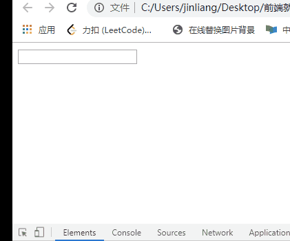
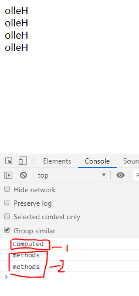
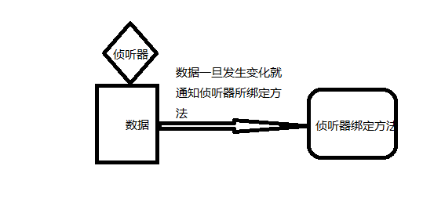
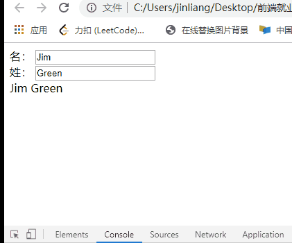
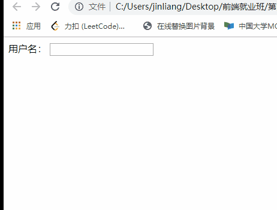
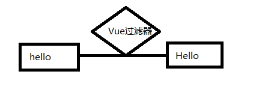

##1.Vue常用特性
###1.1 常用特性概述
* 表单操作
* 自定义指令
* 计算属性
* 过滤器
* 侦听器
* 生命周期

###1.2 表单操作
1.基于Vue的表单操作
* input 单行文本
* textarea 多行文本
* select 下拉多选
* radio 单选框
* checkbox 复选框

2.表单操作
```
<!DOCTYPE html>
<html lang="en">

<head>
    <meta charset="UTF-8">
    <title>Document</title>
    <style type="text/css">
    form div {
        height: 40px;
        line-height: 40px;
    }

    form div:nth-child(4) {
        height: auto;
    }

    form div span:first-child {
        display: inline-block;
        width: 100px;
    }
    </style>
</head>

<body>
    <div id="app">
        <form action="http://itcast.cn">
            <div>
                <span>姓名：</span>
                <span>
                    <input type="text" v-model='uname'>
                </span>
            </div>
            <div>
                <span>性别：</span>
                <span>
                    <input type="radio" id="male" value="1" v-model='gender'>
                    <label for="male">男</label>
                    <input type="radio" id="female" value="2" v-model='gender'>
                    <label for="female">女</label>
                </span>
            </div>
            <div>
                <span>爱好：</span>
                <input type="checkbox" id="ball" value="1" v-model='hobby'>
                <label for="ball">篮球</label>
                <input type="checkbox" id="sing" value="2" v-model='hobby'>
                <label for="sing">唱歌</label>
                <input type="checkbox" id="code" value="3" v-model='hobby'>
                <label for="code">写代码</label>
            </div>
            <div>
                <span>职业：</span>
                <select v-model='occupation' multiple>
                    <option value="0">请选择职业...</option>
                    <option value="1">教师</option>
                    <option value="2">软件工程师</option>
                    <option value="3">律师</option>
                </select>
            </div>
            <div>
                <span>个人简介：</span>
                <textarea v-model='desc'></textarea>
            </div>
            <div>
                <input type="submit" value="提交" @click.prevent='handle'>
            </div>
        </form>
    </div>
    <script type="text/javascript" src="js/vue.min.js"></script>
    <script type="text/javascript">
    /*
      表单基本操作
    */
    var vm = new Vue({
        el: '#app',
        data: {
            uname: 'lisi',
            gender: 2,
            hobby: ['2', '3'],
            // occupation: 3
            occupation: ['1','2'],
            desc: 'nihao'
        },
        methods: {
          handle: function() {
            console.log(this.uname);
          }
        }
    });
    </script>
</body>

</html>
```

3.表单域修饰符
* number：转化为数值
* trim：去掉开始和结尾的空格
* lazy：将input事件切换为change事件
```
<!DOCTYPE html>
<html lang="en">
<head>
    <meta charset="UTF-8">
    <title>Document</title>
</head>
<body>
    <div id="app">
        <input type="text" name="" id="" v-model.number='age'>
        <input type="text" name="" id="" v-model.trim='info'>
        <input type="text" name="" id="" v-model.lazy='msg'>
        <div>{{ msg }}</div>
        <button @click='handle'>提交</button>
    </div>

    <script src="js/vue.min.js"></script>
    <script>
        let vm = new Vue({
            el: "#app",
            data: {
                age: '',
                info: '',
                msg: ''
            },
            methods: {
                handle: function() {
                    console.log(this.age*2);
                    console.log(this.info.length);

                }
            }
        })
    </script>
</body>
</html>
```

###1.3 自定义指令
1.为何需要自定义指令？
内置指令不满足需求

2.自定义指令的语法规则（例如获取元素焦点）
```
Vue.directive('foucs',{
    inserted:function(el) {
        el.foucs();
    }
})
```

3.自定义指令用法
```
<input type='text' v-foucs/>
```

```
<!DOCTYPE html>
<html lang="en">
<head>
    <meta charset="UTF-8">
    <title>Document</title>
</head>
<body>
    <div id="app">
        <input type="text" v-focus>
    </div>

    <script src="js/vue.min.js"></script>
    <script>
        Vue.directive('focus',{
            inserted: function(el) {
                //el表示指令所表示的元素
                el.focus();
            }
        });

        let vm = new Vue({
            el: '#app',
            data: {

            },
            methods: {

            }
        })
    </script>
</body>
</html>
```


4.带参数的自定义指令（例如改变元素背景颜色）
```
Vue.directive('color',{
    bind: function(el,binding) {
        el.style.backgroundColor = binding.value.color
    }
})
```
用法：
```
<input type='text' v-color='{color:'orange'}'/>
```

```
<!DOCTYPE html>
<html lang="en">
<head>
    <meta charset="UTF-8">
    <title>Document</title>
</head>
<body>
    <div id="app">
        <input type="text" name="" id="" v-color='msg'>
    </div>
    <script src="js/vue.min.js"></script>
    <script>

        Vue.directive('color',{
            bind: function(el,binding) {
                el.style.backgroundColor = binding.value.color;
            }
        })
        let vm = new Vue({
            el: "#app",
            data: {
                msg: {
                    color: 'orange'
                }
            }
        })
    </script>
</body>
</html>
```


5.局部指令(只能在本组件中使用)
```
directives: {
    focus: {
        //指令的定义
        inserted:function(el) {
            el.focus()
        }
    }
}
```

###1.4 计算属性
1.为何需要计算属性？
表达式的计算逻辑可能会比较复杂，使用计算属性可以使模板内容更加简介

2.计算属性的方法（例如字符串反转）
```
computed: {
    reversedMessage: function(){
        return this.msg.split('').reverse().join('')
    }
}
```

```
<!DOCTYPE html>
<html lang="en">
<head>
    <meta charset="UTF-8">
    <title>Document</title>
</head>
<body>
    <div id="app">
        <div>{{msg}}</div>
        <div>{{reverseString}}</div>
    </div>
    <script src="js/vue.min.js"></script>
    <script>
        let vm = new Vue({
            el: "#app",
            data: {
                msg: 'Hello'
            },
            computed: {
                reverseString: function() {
                    return this.msg.split('').reverse().join('')
                }
            }
        })
    </script>
</body>
</html>
```


3.计算属性和方法的区别
* 计算属性是基于它们的依赖进行缓存的
* 方法不存在缓存

```
<!DOCTYPE html>
<html lang="en">
<head>
    <meta charset="UTF-8">
    <title>Document</title>
</head>
<body>
    <div id="app">
        <div>{{reverseString}}</div>
        <div>{{reverseString}}</div>
        <div>{{reverseMessage()}}</div>
        <div>{{reverseMessage()}}</div>
    </div>
    <script src="js/vue.min.js"></script>
    <script>
        let vm = new Vue({
            el: "#app",
            data: {
                msg: 'Hello'
            },
            methods: {
                reverseMessage: function() {
                    console.log('methods');
                    return this.msg.split('').reverse().join('')
                }
            },
            computed: {
                reverseString: function() {
                    console.log('computed');
                    return this.msg.split('').reverse().join('')
                }
            }
        })
    </script>
</body>
</html>
```


###1.5 侦听器

1.侦听器的应用场景
 * 数据变化时执行异步或开销较大的操作

2.侦听器的用法

```
<!DOCTYPE html>
<html lang="en">
<head>
    <meta charset="UTF-8">
    <title>Document</title>
</head>
<body>
    <div id="app">
        <div>
            <span>名：</span>
            <span>
                <input type="text" v-model='firstName'>
            </span>
        </div>
        <div>
            <span>姓：</span>
            <span>
                <input type="text" v-model='lastName'>
            </span>
        </div>
        <div>{{fullName}}</div>
    </div>

    <script src="js/vue.min.js"></script>
    <script>
        let vm = new Vue({
            el: "#app",
            data: {
                firstName: 'Jim',
                lastName: 'Green',
                fullName: 'Jim Green'
            },
            //侦听器
            watch: {
                firstName: function(val) {
                    this.fullName = val + ' ' + this.lastName;
                },
                lastName: function(val) {
                    this.fullName = this.firstName + ' ' + val;
                }
            }
        })
    </script>
</body>
</html>

```

3.案例：验证用户名是否可用

```
<!DOCTYPE html>
<html lang="en">
<head>
    <meta charset="UTF-8">
    <title>Document</title>
</head>
<body>
    <div id="app">
            <span>用户名：</span>
            <input type="text" v-model.lazy='uname'>
            <span>{{ tip }}</span>
    </div>

    <script src="js/vue.min.js"></script>
    <script>
        /*
        1.采用侦听器监听用户名的变化
        2.调用后台接口进行验证
        3.根据验证的结果调整提示信息
        */
        let vm = new Vue({
            el: "#app",
            data: {
                uname: '',
                tip: ''
            },
            methods: {
                checkName: function(uname) {
                    //调用接口，但是可以使用定时任务的方式模拟接口调用
                    var that = this;
                    setTimeout(function(){
                        if(uname == 'admin'){
                            that.tip = '用户名已存在，请更换'
                        } else {
                            that.tip = '用户名可以使用'
                        }
                    },2000)
                }
            },
            watch: {
                uname: function(val) {
                    //调用后台接口验证用户名的合法性
                    this.checkName(val);
                    //修改提示信息
                    this.tip = '正在验证...'
                }
            }
        })
    </script>
</body>
</html>
```

###1.6 过滤器
1.过滤器的作用
格式化数据，比如将字符串格式化为首字母大写，将日期格式化为指定的格式等


2.自定义过滤器
```
Vue.filter('过滤器名称',function(val) {
    //过滤器业务逻辑
    ...
})
```

3.过滤器的使用
```
<div>{{数据 | 过滤器名称}}</div>
<div>{{数据 | 过滤器名称 | 过滤器名称 | ...}}</div>
<div :id ='数据 | 过滤器名称'></div>
```

4.局部过滤器(只有在本组件中可以使用)
```
filters: {
    过滤器名称：function(val) {
        //过滤器业务逻辑
        ...
    }
}
```

5.带参数的过滤器
```
Vue.filter('format',function(val,arg) {
        //val就是过滤器传过来的参数
        ...
})
```

6.过滤器的使用
```
<div>{{data | format('yyy')}}</div>
```

**案列：使用过滤器格式化日期**
```
<!DOCTYPE html>
<html lang="en">
<head>
    <meta charset="UTF-8">
    <title>Document</title>
</head>
<body>
    <div id="app">
        <div>{{ date | format('yyyy-MM-dd')}}</div>
    </div>

    <script src="js/vue.min.js"></script>
    <script>
        Vue.filter('format',function(val,arg) {
            if(arg == 'yyyy-MM-dd') {
                var ret ='';
                ret += val.getFullYear() + '-' + (val.getMonth()+1) +'-' + val.getDate();
                return ret;

            }
            return val;
        })
        var vm = new Vue({
            el: "#app",
            data: {
                date: new Date()
            }
        })
    </script>
</body>
</html>
```

###1.7 Vue生命周期
1.主要阶段
* 挂载
(1)beforeCreate
(2)created
(3)beforeMount
(4)mounted

* 更新
(1)beforeUpdate
(2)updated

* 销毁
(1)beforeDestroy
(2)destroyed

2.Vue实例的产生过程
(1)beforeCreate在实例初始化之后，数据观测和事件配置之前被调用
(2)created在实例创建完成后被立即调用
(3)beforeMount在挂载开始之前被调用
(4)mounted el被新创建的vm.$el替换，并挂载到实例上去之后调用
(5)beforeUpdate数据更新时调用，发生在虚拟DOM打补丁之前
(6)updated由于数据更改导致的虚拟DOM更新渲染和打补丁
(7)beforeDestroy实例销毁之前调用
(8)destroyed实例销毁后调用


##2.案列--图书管理
1.图书列表
* 实现静态列表效果
* 基于数据实现模板效果
* 处理每行的操作按钮


2.添加图书
* 实现表单的静态效果
* 添加图书表单域数据绑定
* 添加按钮事件绑定
* 实现添加业务逻辑

3.修改图书
* 修改信息填充到表单
* 修改后重新提交表单
* 重用添加和修改的方法

4.删除图书
* 删除按钮绑定事件处理方法
* 实现删除业务逻辑

