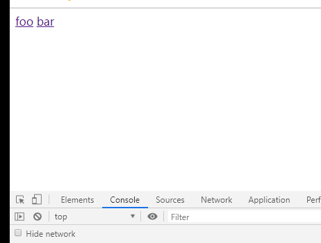

##1.路由的基本概念和原理
###1.1路由
**1.后端路由**

* 概念：根据不同的用户URL请求，返回不同的内容
* 本质：URL请求地址与服务器资源之间的对应关系

**2.SPA(Single Page Application)**

* 后端渲染（存在性能问题）
* Ajax前端渲染（前端渲染提高性能，但是不支持浏览器的前进后退操作）
* SPA(Single Page Application)单页面应用程序：整个网站只有一个页面，内容的变化通过Ajax局部实现更新、同时支持浏览器地址栏的前进和后退操作
* SPA实现原理之一：基于URL地址的hash（hash的变化会导致浏览器记录访问历史的变化、但是hash的变化不会触发新的URL请求）
* 在实现SPA的过程中、最核心的技术就是前端路由

**3.前端路由**

* 概念：根据不同的用户事件，显示不同的页面内容
* 本质：用户事件与事件处理函数之间的对应关系

**4.实现简单前端路由**

* 基于URL中的hash实现（点击菜单的时候改变URL的hash值，根据hash的变化控制组件的切换）


*代码如下*
```
<!DOCTYPE html>
<html lang="en">
<head>
    <meta charset="UTF-8">
    <title>Document</title>
    <style>
        * {
            margin: 0;
            padding: 0
        }

        [v-cloak] {
            display: none
        }

        #app {
            width: 500px;
            height: 500px;
        }
        #app nav {
            width: 100%;
            display: flex;
        }
        #app a{
            text-decoration: none;
            padding: 0 40px
        }
    </style>
    <div id="app" v-cloak>
        <div id="nav">
            <a :key ="item.id" v-for="item in aA" :href="item.a">{{item.c}}</a>
        </div>
        <component :is="comName" style="text-align: center"></component>
    </div>
</head>
<body>
    <script src="js/vue.js"></script>
    <script>
        var zy = {
            template: `<div>主页信息</div>`
        }
        var kj = {
            template: `<div>科技信息</div>`
        }
        var cj = {
            template: `<div>财经信息</div>`
        }
        var yl = {
            template: `<div>娱乐信息</div>`
        }
        var vm = new Vue({
            el: "#app",
            data: {
                aA:[{
                    id: 1,
                    a: "#/zy",
                    c: "主页"
                },{
                    id: 2,
                    a: "#/kj",
                    c: "科技"
                },{
                    id: 3,
                    a: "#/cj",
                    c: "财经"
                },{
                    id: 4,
                    a: "#/yl",
                    c: "娱乐"
                }],
                comName: 'zy'
            },
            components: {
                'zy':zy,
                'kj':kj,
                'cj':cj,
                'yl':yl
            }
        });
        window.onhashchange = function() {
            switch(location.hash.slice(1)) {
                case '/zy':
                    vm.comName = 'zy'
                    break;
                case '/kj':
                    vm.comName = 'kj'
                    break;
                case '/cj':
                    vm.comName = 'cj'
                    break;
                case '/yl':
                    vm.comName = 'yl'
                    break;
            }
        }
    </script>
</body>
</html>
```

##2. Vue Router
Vue Router（官网<https://router.vuejs.org/zh>）是Vue.js官方的路由管理器
他和Vue.js的核心深度集成，可以非常方便的用于SPA应用程序的开发

包含的功能有：
* 嵌套的路由/视图表
* 模块化的、基于组件的路由配置
* 路由参数、查询、通配符
* 基于 Vue.js 过渡系统的视图过渡效果
* 细粒度的导航控制
* 带有自动激活的 CSS class 的链接
* HTML5 历史模式或 hash 模式，在 IE9 中自动降级
* 自定义的滚动条行为

###2.1 Vue Router的基本使用步骤
* 引入相关的库文件
```
<script src="/path/to/vue.js"></script>
<script src="/path/to/vue-router.js"></script>
```

* 添加路由链接
```
<!-- 使用 router-link 组件来导航. -->
<!-- 通过传入 `to` 属性指定链接. -->
<!-- <router-link> 默认会被渲染成一个 `<a>` 标签 -->
<router-link to="/foo">Go to Foo</router-link>
<router-link to="/bar">Go to Bar</router-link>
```

* 添加路由填充位
```
  <!-- 路由填充位（也叫做路由占位符） -->
  <!-- 路由匹配到的组件将渲染在这里 -->
  <router-view></router-view>
```

* 定义路由组件
```
const Foo = { template: '<div>foo</div>' }
const Bar = { template: '<div>bar</div>' }
```

* 配置路由规则并创建路由实例
```
//配置路由规则
const routes = [
  { path: '/foo', component: Foo },
  { path: '/bar', component: Bar }
]
//创建路由实例
const router = new VueRouter({
  routes
})
```

* 把路由挂载到Vue根实例中
```
const app = new Vue({
  router
}).$mount('#app')
```


###2.2 路由重定向
*路由重定向指的是：用户在访问地址A的时候，强制用户跳转到地址C，从而展示特定的组件页面*

*通过路由规则的redirect属性，指定一个新的路由地址，可以很方便地设置路由的重定向*

```
const routes = [
          {path: '/',redirect: '/foo'}
          { path: '/foo', component: Foo },
          { path: '/bar', component: Bar }
        ]
```

##3.Vue-Router嵌套路由
###3.1 嵌套路由用法
**1.嵌套路由功能分析**

* 点击父级路由链接显示模板内容
* 模板内容中又有子级路由链接
* 点击子级路由链接显示自己模板内容

**2.父路由组件模板**

* 父级路由链接
* 父组件路由填充位
```
<router-link to='/foo'>foo</router-link>
<router-link to='/bar'>bar</router-link>

<router-view></router-view>
```

**3.子级路由模板**

* 子级路由链接
* 子级路由填充位
```
const Bar = { template: `
    <div>
        <h1>Bar组件</h1>
        <router-link to='/bar/tab1'>Tab1</router-link>
        <router-link to='/bar/tab2'>Tab2</router-link>

        <!--子路由填充规则-->
        <router-view></router-view>
    </div>`
}
```


**4.嵌套路由配置**

* 父级路由通过children属性配置子级路由
```
onst routes = [
          { path: '/foo', component: Foo },
          { path: '/bar',
          component: Bar,
          //通过children属性为/bar添加子路由规则
          children: [
            {path: '/bar/tab1',component: Tab1},
            {path: '/bar/tab2',component: Tab2}
          ]
        }
        ]
```

**5.实例效果**



##4.Vue-Router动态路由匹配
###4.1基本用法
```
<!--有如下三个路由链接-->
<router-link to='/bar/1'>bar1</router-link>
<router-link to='/bar/2'>bar2</router-link>
<router-link to='/bar/3'>bar3</router-link>
```

```
//动态路径参数，以冒号开头
const routes = [{path: '/bar/:id'},component: Bar]
```

```
const Bar = {
    //路由组件中通过$route.params获取路由参数
    template: '<div>Bar {{$route.params.id}}</div>'
}

```

###4.2 路由组件传递参数
$route与对应路由形成高度耦合，不够灵活，所有可以使用props将组件和路由解耦

**1.props的值为布尔类型**
```
const router = new VueRouter({
    routes: [
        //如果props被设置为true，route.params将会设置为组件属性
        {path: '/user/:id', component: User, props: true}
    ]
})

const User = {
    props: ['id'];
    template: '<div>User {{id}} 组件</div>'
}
```

**2.props的值为对象类型**
```
const router = new VueRouter({
    routes: [
        //如果props被设置为true，route.params将会设置为组件属性
        {path: '/user/:id', component: User, props: {uname: 'lisi', age: 20}}
    ]
})

const User = {
    props: ['uname', 'age'];
    template: '<div>User {{uname + '--' + age}} 组件</div>'
}
```

**3.props的值为函数类型**
```
const router = new VueRouter({
    routes: [
        //如果props被设置为true，route.params将会设置为组件属性
        {path: '/user/:id', component: User, props: route => ({uname: 'lisi',age: 20,id:route.params.id})}
    ]
})

const User = {
    props: ['uname', 'age','id'];
    template: '<div>User {{uname + '--' + age + '---' + id}} 组件</div>'
}
```

##5.Vue-router命名路由
###5.1 命名路由的配置规则
*为了更加方便的表示路由的路径，可以给路由规则起一个别名，即为“命名路由”*
```
const routes = [
          { path: '/foo/:id',name: 'foo', component: Foo }
        ]
```

```
<router-link :to="{name: 'foo', params: {id: 123}}">foo</router-link>
```

##6.Vue-Router编程式导航
###6.1 页面导航的两种方式
* 声明式导航 ：通过点击链接实现导航的方式，叫做声明式导航。例如普通网页中的a链接或vue中的<router-link></router-link>
* 编程式导航：通过调用JavaScript形式的API实现导航的方式，叫做编程式导航。例如普通网页中的location.href

###6.2 基本用法
* this.$router.push('hash地址')
* this.$router.go(n)
```
const Foo = {
    template: '<div><button @click='goBar'>Foo组件</button></div>',
    methods: {
        goBar: function(){
            //用编程式的方法控制路由跳转
            this.$router.push('/bar')
        }
    }
}
```

